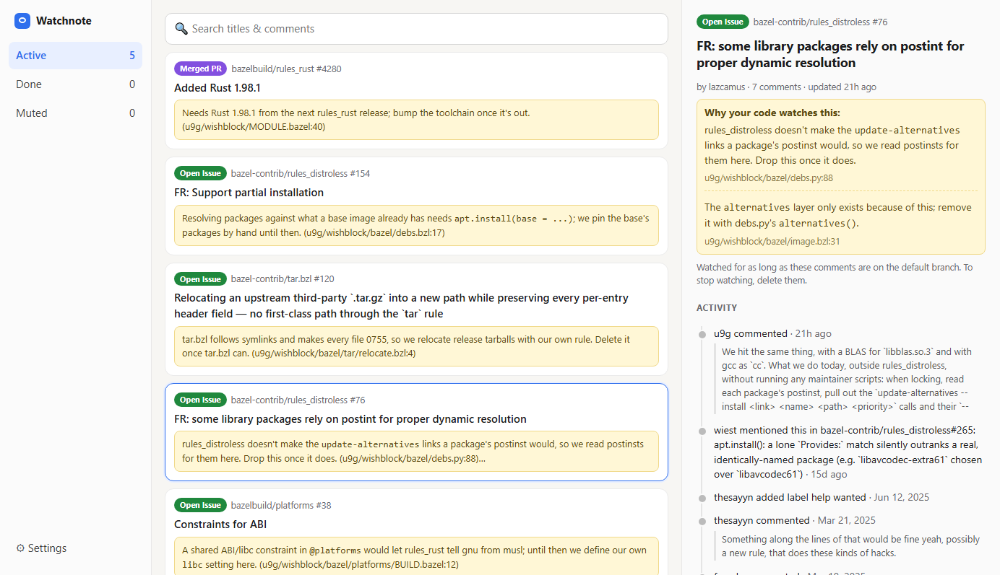
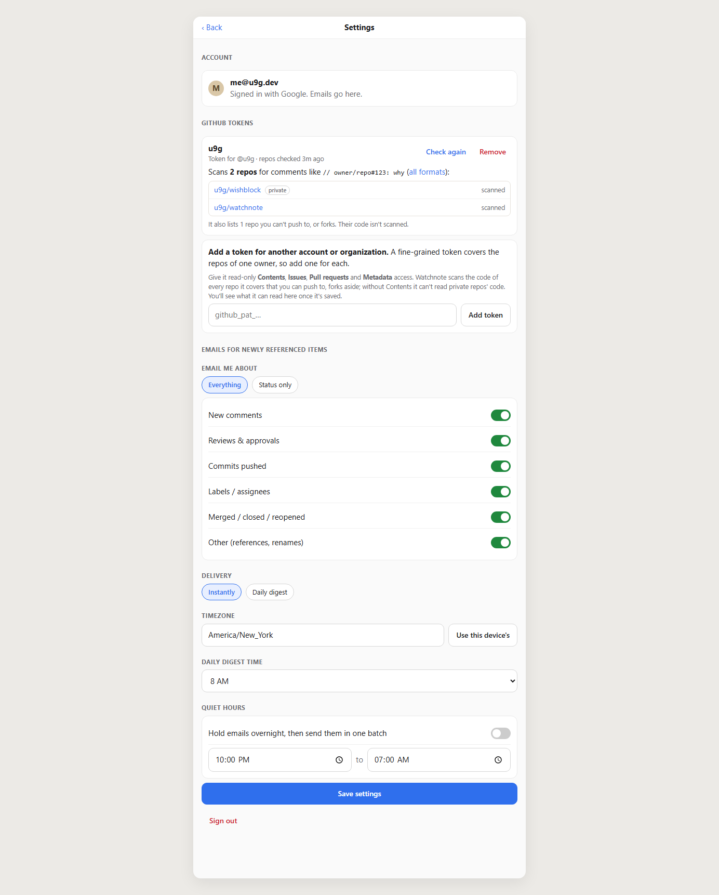

# Watchnote

A hosted instance is available at [watchnote.u9g.dev](https://watchnote.u9g.dev).

When code exists because of a GitHub issue or pull request, say so in a comment:

```go
// octo/hello#7: Retry until shutdown stops racing; delete once this is fixed.
for !shutdown() { time.Sleep(time.Second) }
```

Watchnote finds comments like this in your repos and emails you whenever something
happens to the issue or PR they reference. Each email starts with the comment, linked to
its line, so you know **why** you care. Delete the comment and the item stops being
watched. Comments are the only way to watch anything: there are no notes to type in, and
nothing to add or remove by hand.





- Sign in with Google. Emails go to that address.
- Save a read-only fine-grained GitHub token in Settings for each account or
  organization whose code should be read. Settings lists the repos each one scans.
- Any comment works (`//`, `#`, `--`, `;`, `%`, `/* */`, `<!-- -->` and so on), as does
  a line of its own inside a docstring, or an added line in a `.patch` file: what counts is
  a line that starts with `owner/repo#N: ` once any leading punctuation is set aside.
  [Every comment style that works](https://watchnote.u9g.dev/docs/code-comments) is listed
  at `/docs/code-comments`, no sign-in needed.
- Pick what to hear about for each item: everything, status changes only, or a custom mix
  of comments, reviews, commits, labels/assignees, state changes and references. Newly
  referenced items start with your defaults from Settings.
- Emails arrive within a couple of minutes, or as a daily digest. Bursts are batched,
  and quiet hours hold emails overnight.
- After a PR merges, you get one more email when the repo's latest GitHub release first
  contains it, for fixes you're waiting to pick up from a release.
- Merged/closed/released emails ask whether you're done. Done items stay quiet unless they're
  reopened. Nothing is archived automatically.
- Each watch has a **done badge**: paste its Markdown from the item page into a PR
  description to see whether you're done without opening Watchnote. It's re-fetched on every
  view, and clicking it opens the item (for you only) to change that.
- Every email has one-click links to mute or switch to status-only, plus a standard
  `List-Unsubscribe` header, which mutes. Only deleting the comment stops a watch.

It's a single Go binary with server-rendered HTML and SQLite. It works on phones
and desktops and installs as a PWA.

## How it works

GitHub only allows webhooks on repos you administer, so Watchnote **polls**:

1. Each watched item is fetched with `If-None-Match`. A `304 Not Modified` costs
   nothing against the rate limit. PRs use the `/pulls` endpoint, whose ETag also
   changes when commits are pushed.
2. When something changed (and at least hourly regardless), the item's
   [timeline](https://docs.github.com/en/rest/issues/timeline) is read from the last
   page seen. New events are stored once per item, however many people watch it.
3. Polling backs off for quiet items: every 2 minutes if active in the last day,
   10 minutes within a week, then hourly. Closed and merged items are polled hourly
   in case they're reopened.
4. The mailer compares each watch's cursor against new events, applies that watch's
   filter, waits 60s for bursts to settle (5 minutes at most), respects quiet hours,
   and sends one email.

Separately, every 5 minutes, the repos each GitHub token can see are listed. Those the
user can push to, forks aside, are read again when their `pushed_at` has moved: the
default branch's tarball is scanned for reference comments, each referenced item is
watched, and watches whose last comment is gone stop. When a token can't read a repo's
code, Settings says whether the token lacks the **Contents** permission or doesn't cover
the repo, and the next token that lists it is tried.

An issue closed by a PR shows up on the issue's own timeline, so watching the issue
is enough.

## Deploying with Helm

Images are published to `ghcr.io/u9g/watchnote` by CI. On `vX.Y.Z` tags, the chart is
also published to `oci://ghcr.io/u9g/charts/watchnote`.

You'll need:

1. **Google OAuth client** ([console](https://console.cloud.google.com/apis/credentials)):
   type "Web application", with authorized redirect URI `https://<your-host>/auth/google/callback`.
   The only scopes used are `openid email profile`.
2. **SMTP**: any provider works (Postmark, SES, Resend, Mailgun…). Port 587 uses
   STARTTLS; port 465 uses implicit TLS. Set up SPF/DKIM for the `MAIL_FROM` domain.
3. **GitHub token** (recommended): polls public issues and PRs. Any token works, even one
   with no scopes. Without one, GitHub allows only 60 requests/hour. Users' own tokens,
   saved in Settings, read their code and private items.

```sh
helm install watchnote oci://ghcr.io/u9g/charts/watchnote \
  --namespace watchnote --create-namespace \
  --set baseUrl=https://watchnote.example.com \
  --set secrets.googleClientId=... \
  --set secrets.googleClientSecret=... \
  --set secrets.githubToken=... \
  --set mail.from="Watchnote <notify@example.com>" \
  --set mail.smtpHost=smtp.postmarkapp.com \
  --set mail.smtpUsername=... \
  --set secrets.smtpPassword=... \
  --set ingress.enabled=true --set ingress.tls.enabled=true
```

To deploy from a checkout instead, use `helm install watchnote ./chart/watchnote ...`.
To run an image built from `main`, add `--set image.tag=main`.

Notes:

- **Single replica only.** Data lives in SQLite on a `ReadWriteOnce` volume, and the
  poller runs in-process. The chart hard-codes `replicas: 1` with the `Recreate`
  strategy. The PVC is kept on uninstall (`helm.sh/resource-policy: keep`).
- `secrets.secretKey` signs sessions and email links and encrypts saved GitHub
  tokens. If you leave it empty, one is generated on install and reused on upgrades.
  To manage secrets yourself, set `existingSecret` to a Secret with keys `SECRET_KEY`,
  `GOOGLE_CLIENT_ID`, `GOOGLE_CLIENT_SECRET` and optionally `GITHUB_TOKEN` and
  `SMTP_PASSWORD`.
- To keep the mail settings in a Secret too, set `mail.existingSecret` to one with
  keys `MAIL_FROM` and `SMTP_HOST`, and optionally `SMTP_PORT`, `SMTP_USERNAME` and
  `SMTP_PASSWORD`. Pods read it at start, so restart the Deployment after changing it.
- While the GHCR package is private, create a pull secret and set
  `imagePullSecrets: [{name: ghcr-pull}]`.

See [`chart/watchnote/values.yaml`](chart/watchnote/values.yaml) for all options.

## Configuration

| Variable | Default | |
|---|---|---|
| `BASE_URL` | `http://localhost:8080` | Public URL, used in OAuth redirects and email links |
| `SECRET_KEY` | (none) | Required, at least 32 characters |
| `GOOGLE_CLIENT_ID` / `GOOGLE_CLIENT_SECRET` | (none) | Required unless `DEV_LOGIN=true` |
| `GITHUB_TOKEN` | (none) | App-wide token for public repos |
| `DATABASE_PATH` | `watchnote.db` | SQLite file (`/data/watchnote.db` in the image) |
| `LISTEN_ADDR` | `:8080` | |
| `MAIL_MODE` | `smtp` | `log` prints emails to stdout instead |
| `MAIL_FROM` | (none) | e.g. `Watchnote <notify@example.com>` |
| `SMTP_HOST` / `SMTP_PORT` / `SMTP_USERNAME` / `SMTP_PASSWORD` | port `587` | |
| `DEV_LOGIN` | `false` | Local development only: sign in as any email without Google |

## Local development

```sh
DEV_LOGIN=true MAIL_MODE=log SECRET_KEY=$(openssl rand -hex 32) \
  GITHUB_TOKEN=$(gh auth token) go run .
# open http://localhost:8080
go test ./...
```

`go test` runs end-to-end against a fake GitHub API. It covers code scanning,
polling, batching, filters, mute/done/reopen, quiet hours, digests, signed email links
and the web UI.
